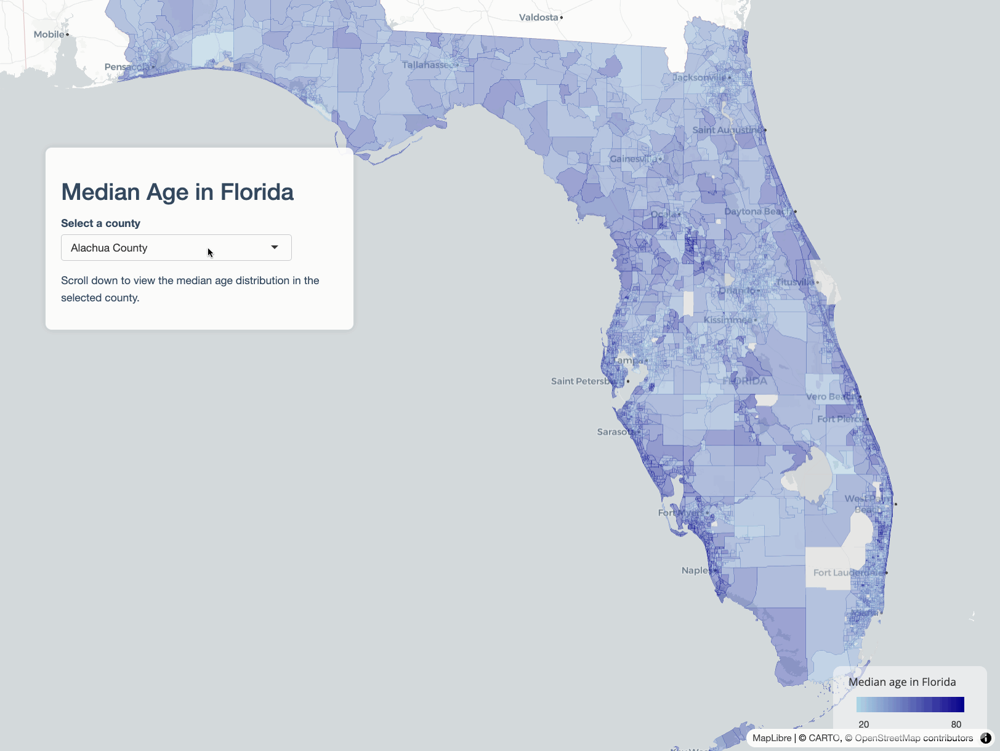

*Story maps* are effective tools for communicating map-based narratives. In a story map, users typically scroll through a web page in which different map views and elements of the "story" are shown as the user scrolls down. The **mapgl** package brings story maps in Shiny to R users, and supports both Mapbox and MapLibre backends as well as Leaflet.

This tutorial will help you learn how to build a basic story map Shiny app with mapgl. You'll rely on the following three functions when building your story:

-   `story_map()` sets up the user interface component for your story map. You'll wrap this in a Shiny layout function; it is recommended to use `fluidPage()` (or `bslib::page_fluid()`) which will get you a standard full-screen story map template. `story_map()` defaults to Mapbox maps; you can use `story_maplibre()` for MapLibre maps, and `story_leaflet()` for Leaflet.

-   Within `story_map()`, you'll define a named list of sections to be passed to the `sections` parameter. You'll use the `story_section()` function to build each section. In `story_section()`, you'll specify a `title` (set to NULL or `""` to omit it) as well as `content`, which will be a list of UI elements you want to put in your section panel. This can be HTML elements (defined with `tags$p()`, `tags$a()`, `tags$img()`, etc.) as well as Shiny inputs or outputs.

-   Within your `server` function, you'll then use the `on_section()` function to bring your story map to life. `on_section()` allows you to link Shiny events to specific story sections. This means that you can trigger map movements, add data, or even perform analyses on user scroll.

## Moving the map on scroll

Let's take a look at how this works with a basic example. We'll build a story map with two sections: an introductory section, and a second section where the map "flies to" a location when the user scrolls.

To get started, let's build a basic user interface without any map actions. In `ui`, we set up `story_map()` inside a fluid page with two sections. In `server`, we'll create a Mapbox globe with `mapboxgl()` and `renderMapboxgl()`. In most cases you'll want to set the option `scrollZoom = FALSE` when you initialize your map so map scrolling behavior doesn't interfere with story scrolling.

```{r, eval = FALSE}
library(shiny)
library(mapgl)

ui <- fluidPage(
  story_map(
    map_id = "map",
    sections = list(
      "intro" = story_section(
        "Introduction",
        "This is a story map."
      ),
      "location" = story_section(
        "Location",
        "Check out this interesting location."
      )
    )
  )
)

server <- function(input, output, session) {
  output$map <- renderMapboxgl({
    mapboxgl(scrollZoom = FALSE)
  })
}

shinyApp(ui, server)
```


You'll note that scrolling will transition between story sections, and that you can still interact with the map by clicking and panning. However, because we haven't set up any actions in `server`, nothing else happens when you scroll between sections.

We can change this by using the `on_section()` function. In `on_section()`, you'll specify the map ID (in this case, `"map"`) and the section ID to link to an action; the section ID is the name of the corresponding list element defined in the list passed to `sections` in the UI. You'll then define an expression, much like you would in `observeEvent()` in Shiny, to be executed when a given section appears.

```{r, eval = FALSE}
library(shiny)
library(mapgl)

ui <- fluidPage(
  story_map(
    map_id = "map",
    sections = list(
      "intro" = story_section(
        "Introduction",
        "This is a story map."
      ),
      "location" = story_section(
        "Location",
        "Check out this interesting location."
      )
    )
  )
)

server <- function(input, output, session) {
  output$map <- renderMapboxgl({
    mapboxgl(scrollZoom = FALSE)
  })
  
  on_section("map", "location", {
    mapboxgl_proxy("map") |> 
      fly_to(center = c(12.49257, 41.890233), 
             zoom = 17.5,
             pitch = 49,
             bearing = 12.8)
  })
  
}

shinyApp(ui, server)
```


The map zooms into the Colosseum in Rome on user scroll. If you scroll back up to the top, however, you'll notice that the view does not return to the original globe. This can be remedied by tying an `on_section()` event to the introductory section.

```{r, eval = FALSE}
library(shiny)
library(mapgl)

ui <- fluidPage(
  story_map(
    map_id = "map",
    sections = list(
      "intro" = story_section(
        "Introduction",
        "This is a story map."
      ),
      "location" = story_section(
        "Location",
        "Check out this interesting location."
      )
    )
  )
)

server <- function(input, output, session) {
  output$map <- renderMapboxgl({
    mapboxgl(scrollZoom = FALSE)
  })
  
  on_section("map", "intro", {
    mapboxgl_proxy("map") |> 
      fly_to(center = c(0, 0),
             zoom = 0,
             pitch = 0,
             bearing = 0)
  })
  
  on_section("map", "location", {
    mapboxgl_proxy("map") |> 
      fly_to(center = c(12.49257, 41.890233), 
             zoom = 17.5,
             pitch = 49,
             bearing = 12.8)
  })
  
}

shinyApp(ui, server)
```


For map transitions, in addition to `fly_to()`, you might consider using `ease_to()` and `jump_to()` depending on your use case. Map transition functions support [camera options](https://docs.mapbox.com/mapbox-gl-js/api/properties/#cameraoptions) and [animation options](https://docs.mapbox.com/mapbox-gl-js/api/properties/#animationoptions) as keyword arguments when applicable.

## Adding data and modifying story appearance

In many cases, you'll want to use story maps to visualize data that you'll add to a Mapbox / MapLibre basemap. Let's build an example of how a real estate firm might use a story map to market a property.  

```{r, eval = FALSE}
library(shiny)
library(mapgl)
library(mapboxapi)

property <- c(-97.71326, 30.402550)
isochrone <- mb_isochrone(property, profile = "driving", time = 20)

ui <- fluidPage(
  tags$link(href = "https://fonts.googleapis.com/css2?family=Poppins:wght@300;400;600&display=swap", rel="stylesheet"),
  story_map(
    map_id = "map",
    font_family = "Poppins",
    sections = list(
      "intro" = story_section(
        title = "MULTIFAMILY INVESTMENT OPPORTUNITY",
        content = list(
          p("New Class A Apartments in Austin, Texas"),
          img(src = "apartment.png", width = "300px")
        ),
        position = "center"
      ),
      "marker" = story_section(
        title = "PROPERTY LOCATION",
        content = list(
          p("The property will be located in the thriving Domain district of north Austin, home to some of the city's best shopping, dining, and entertainment.")
        )
      ),
      "isochrone" = story_section(
        title = "AUSTIN AT YOUR FINGERTIPS",
        content = list(
          p("The property is within a 20-minute drive of downtown Austin, the University of Texas, and the city's major employers.")
        )
      )
    )
  )
)

server <- function(input, output, session) {
  output$map <- renderMapboxgl({
    mapboxgl(scrollZoom = FALSE,
             center = c(-97.7301093, 30.288647),
             zoom = 12)
  })

  on_section("map", "intro", {
    mapboxgl_proxy("map") |>
      clear_markers() |>
      fly_to(center = c(-97.7301093, 30.288647),
             zoom = 12,
             pitch = 0,
             bearing = 0)

  })

  on_section("map", "marker", {
    mapboxgl_proxy("map") |>
      clear_layer("isochrone") |>
      add_markers(data = property, color = "#CC5500") |>
      fly_to(center = property,
             zoom = 16,
             pitch = 45,
             bearing = -90)
  })

  on_section("map", "isochrone", {
    mapboxgl_proxy("map") |>
      add_fill_layer(
        id = "isochrone",
        source = isochrone,
        fill_color = "#CC5500",
        fill_opacity = 0.5
      ) |>
      fit_bounds(
        isochrone,
        animate = TRUE,
        duration = 8000,
        pitch = 75
      )
  })

}

shinyApp(ui, server)
```


Let's break down some key elements of this story map.  

* We're loading a Google font, "Poppins", into our Shiny app with `tags$link()`.  This allows us to use Poppins as our font globally in `story_map()` by passing it as an argument to `font_family`.  The appearance of panels can also be modified section-by-section if you prefer.  

* In each story section panel, we are passing a list of HTML items to `content`.  The introductory section shows how to include a local image (which should be in a `www` folder local to your app); you can also reference remotely-hosted images or include all other HTML elements supported by Shiny.  Also note the `position = "center"` argument to position the introductory panel in the center of the screen; `"left"` is the default, and `"right"` is also supported without the need for additional CSS customization.

* As in the first example, all of our story actions defined in calls to `on_section()` operate on the Mapbox GL proxy object, `"map"`.  In this example, we use `add_markers()` to add a marker at a location, and `add_fill_layer()` to add a 20-minute drivetime isochrone created with the Mapbox API.  Transitions between the views are handled with `fly_to()` and `fit_bounds()`, and `clear_layer()` and `clear_markers()` calls are used to control which data layers are visible as the user goes forward and backward through the story.

## Integrating Shiny inputs and outputs

While the story map feature in __mapgl__ is built in a unique way to accommodate map-based scrollytelling, it is still creating an R Shiny app.  This means that all of Shiny's functionality and interactivity is available to you as you build your story maps.  The list of items you pass to `content` in any given story section panel can include both Shiny _inputs_ as well as Shiny _outputs_ which can correspond to the content visible on your story maps.

Let's set up a scenario that adds interactivity to the data displayed in the [Fundamentals of map design with mapgl](https://walker-data.com/mapgl/articles/map-design.html) vignette.  We'll make a map of median age in Florida, which will display with the introductory story panel.  The user selects a county to display; on scroll, the story will then zoom to the selected county and show a histogram of values for Census tracts in that county.  

```{r, eval = FALSE}
library(shiny)
library(mapgl)
library(tidycensus)
library(tidyverse)
library(sf)

fl_age <- get_acs(
  geography = "tract",
  variables = "B01002_001",
  state = "FL",
  year = 2023,
  geometry = TRUE
) |>
  separate_wider_delim(NAME, delim = "; ", names = c("tract", "county", "state")) %>%
  st_sf()

ui <- fluidPage(
  story_maplibre(
    map_id = "map",
    sections = list(
      "intro" = story_section(
        "Median Age in Florida",
        content = list(
          selectInput(
            "county",
            "Select a county",
            choices = sort(unique(fl_age$county))
          ),
          p("Scroll down to view the median age distribution in the selected county.")
        )
      ),
      "county" = story_section(
        title = NULL,
        content = list(
          uiOutput("county_text"),
          plotOutput("county_plot")
        )
      )
    )
  )
)

server <- function(input, output, session) {

  sel_county <- reactive({
    filter(fl_age, county == input$county)
  })

  output$map <- renderMaplibre({
    maplibre(
      carto_style("positron"),
      bounds = fl_age,
      scrollZoom = FALSE
    ) |>
      add_fill_layer(
        id = "fl_tracts",
        source = fl_age,
        fill_color = interpolate(
          column = "estimate",
          values = c(20, 80),
          stops = c("lightblue", "darkblue"),
          na_color = "lightgrey"
        ),
        fill_opacity = 0.5
      ) |>
      add_legend(
        "Median age in Florida",
        values = c(20, 80),
        colors = c("lightblue", "darkblue"),
        position = "bottom-right"
      )
  })

  output$county_text <- renderUI({
    h2(toupper(input$county))
  })

  output$county_plot <- renderPlot({
    ggplot(sel_county(), aes(x = estimate)) +
      geom_histogram(fill = "lightblue", color = "black", bins = 10) +
      theme_minimal() +
      labs(x = "Median Age", y = "")
  })

  on_section("map", "intro", {
    maplibre_proxy("map") |>
      set_filter("fl_tracts", NULL) |>
      fit_bounds(fl_age, animate = TRUE)
  })

  on_section("map", "county", {
    maplibre_proxy("map") |>
      set_filter("fl_tracts", filter = list("==", "county", input$county)) |>
      fit_bounds(sel_county(), animate = TRUE)
  })

}

shinyApp(ui, server)
```



Let's walk through how this works.

* The UI code will be familiar, though we are now using the MapLibre backend with `story_maplibre()`.  The main difference is our inclusion of a Shiny `selectInput()` in the first story panel and two Shiny outputs in the second story panel.  As we've set it up, users can select a county at the beginning of the story, and then get a different output when they scroll down.  

* A reactive object `sel_county()` will be used to get county-specific values for the second story panel, and will help us determine the map's extent as we want to zoom to the selected county.  

* That said, we don't use `sel_county()` directly on the map.  Instead, we use mapgl's `set_filter()` function, which is more performant than filtering data by clearing a layer and re-adding it.  This allows us to invoke the underlying `setFilter()` JavaScript method ([see here for more documentation](https://maplibre.org/maplibre-gl-js/docs/API/classes/Map/#setfilter)) and operate directly on the map layer itself.  Setting the filter to `NULL` clears the filter and gives us back the entire state of Florida.  

* We note that the content of the second panel is entirely Shiny outputs: an h2 header that corresponds to the selected county, and a histogram of median age values for Census tracts in that county drawn with ggplot2.  

## Sharing your stories / next steps

As your story map is a Shiny app, you'll need to publish it to a Shiny server to share it.  Posit's [ShinyApps.io](https://www.shinyapps.io/) and [Connect Cloud](https://connect.posit.cloud/) products are nice options if you don't want to set up your own Shiny server.  

If you are building story maps with mapgl, please let me know about it!  I'm also planning some trainings / workshops on this feature, so please do reach out if you are interested.